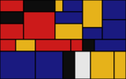
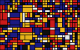

Piet Mondrian Artworks in Rust
==============================

## Usage

```rust
use mondrian::{save, Mondrian};

fn main() {
    let mut s = Mondrian::default();
    save("iter-5.svg", &s.generate(5)).unwrap();

    s.new_rng(); // Otherwise it will generate exactly the same graphics
    s.line_width = 0.8;
    save("iter-10.svg", &s.generate(10)).unwrap();
}
```






## Options

```rust
pub struct Mondrian {
    /// Canvas size
    pub size: f32,
    /// Graphic width
    pub width: f32,
    /// Available colors
    pub colors: Vec<String>,
    /// Color Weights
    pub color_weights: Vec<u32>,
    /// Grid size
    pub grid_round: f32,
    /// Line width
    pub line_width: f32,
    /// Random seed
    pub rng: StdRng,
}
```